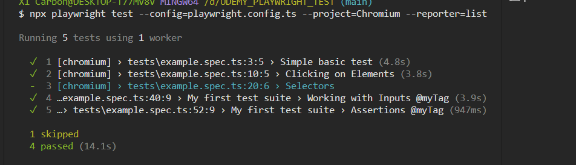

This course is 
Automated Software Testing with Playwright - Udemy

npx playwright test --config=playwright.config.ts --project=Webkit

 npx playwright test --config=playwright.config.ts --project=Chromium --reporter=line

 npx playwright test --config=playwright.config.ts --project=Chromium --reporter=list
 

 npx playwright test --config=playwright.config.ts --project=Chromium --reporter=dot 
 

 npx playwright test --config=playwright.config.ts --project=Chromium --reporter=junit
 

+ Config run:
npm run tests:chrome

npm run tests:webkit -- --headed 

npm run test:e2e

npm run test:e2e -- --headed 

------------
Visual testing
+ npx playwright test --config=visual.config.ts --project=Chromium

+ update snapshot:  npx playwright test --config=visual.config.ts --project=Firefox --update-snapshots

Config run visual test:

+ npm run test:visual:chrome
+ npm run test:visual:chrome -- --headed

Config run visual test, update  snapshot

+ npm run test:visual:chrome:update

Config run API

+ npm run tests:api

Run Jenkins:

Config jenkins run:

Retries test:
+ npx playwright test --config=playwright.config.ts --project=Chromium --retries=3

Generate PDF File
 npx playwright pdf https://www.example.com my-file.pdf